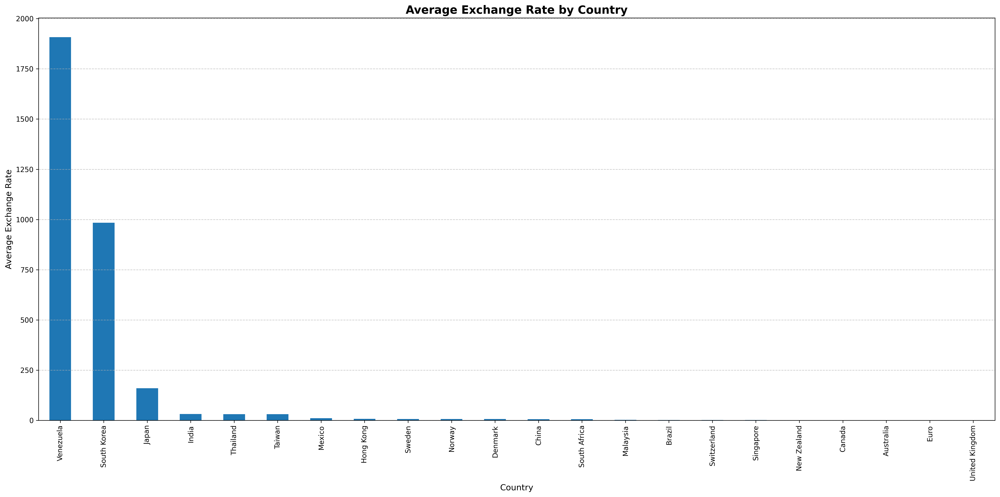
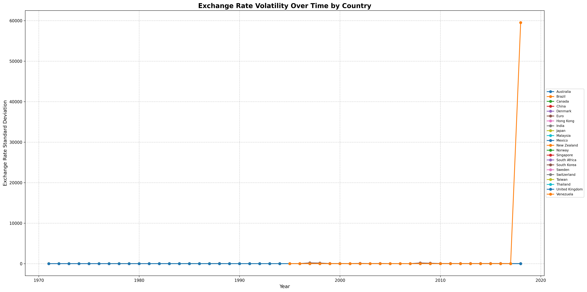
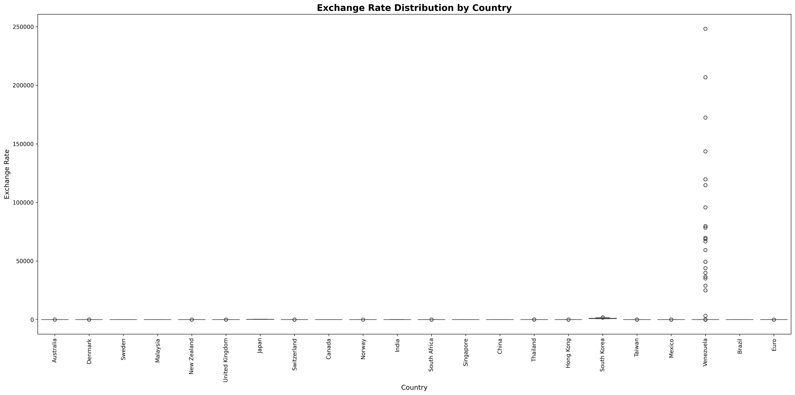
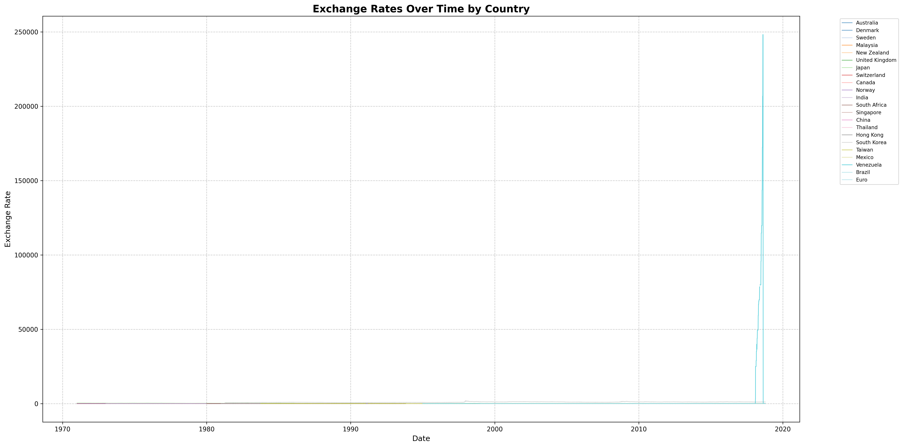
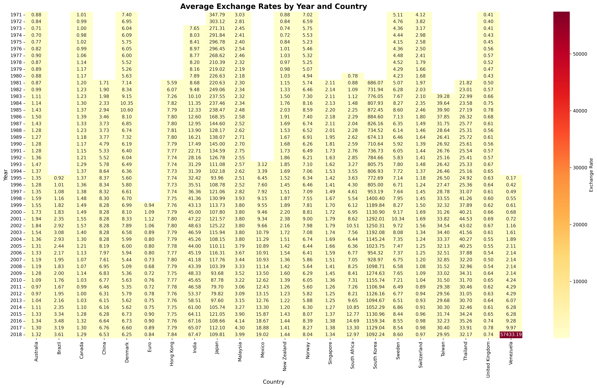
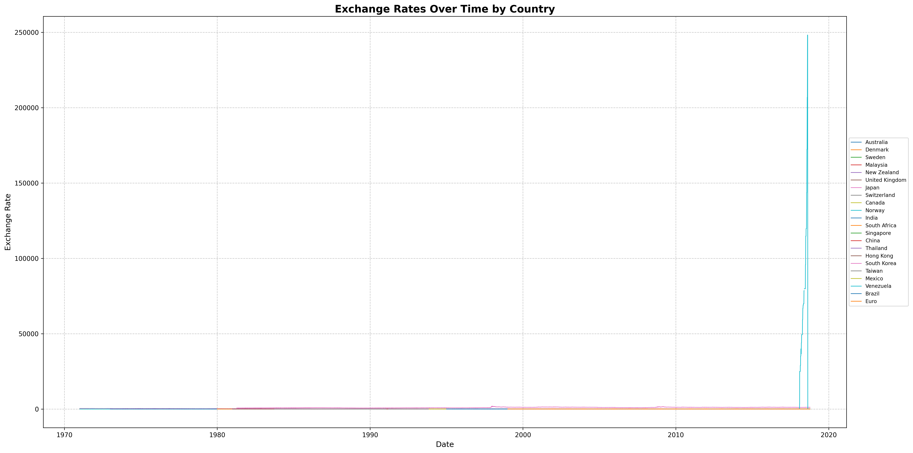

# USA/EUR Foreign Exchange Rate Prediction
Create a model that can predict USA/EUR foreign exchange rate depending on the country and based on history data.

## Dataset Description
The dataset contains data from multiple countries with their conversion rate starting from 1971 to 2018. It is from U.S. Dollars to the respective countries' currencies.

## Summary of Findings
Average Exchange Rate by Country
The countries with the highest average exchange rates are Venezuela, South Korea, and Japan. This suggests these countries' currencies are generally weaker compared to the base currency over the analyzed period.Australia, Euro, and United Kingdom show the lowest average exchange rates, indicating stronger currencies relative to the base currency. This could reflect more stable economies or different monetary policies in these countries.

Exchange Rate Volatility Over Time by Country
For most countries, exchange rate volatility remains relatively low and stable throughout the observed period, with values close to zero on the y-axis. Venezuela stands out dramatically, showing an enormous spike in exchange rate volatility around 2018. The volatility reaches nearly 60,000 on the scale, which is orders of magnitude higher than any other country.The extreme volatility in Venezuela's exchange rate likely reflects severe economic instability, possibly hyperinflation or currency crises.Brazil shows a minor increase in volatility compared to other countries, particularly noticeable from around 2000 onwards. However, this increase is negligible compared to Venezuela's extreme volatility.Most countries, including major economies like Australia, Canada, China, the Euro zone, Japan, and the UK, demonstrate very low and consistent volatility throughout the entire period. 

Exchange Rate Distribution by Country (Boxplot)
Venezuela stands out dramatically with extremely high exchange rate values, reaching up to about 250,000. This is orders of magnitude higher than any other country and likely indicates severe economic issues, possibly hyperinflation.Brazil shows the second-highest exchange rate values, but these are much lower than Venezuela's, reaching up to about 5,000. This suggests significant but less extreme currency devaluation compared to Venezuela. Most countries have their exchange rates clustered very close to zero. This indicates relatively stable currencies with much lower exchange rates compared to Venezuela and Brazil.    

Exchange Rates Over Time by Country

Venezuela shows an extraordinary spike in its exchange rate near the end of the period. The exchange rate skyrockets to about 250,000, which is orders of magnitude higher than any other country. This extreme increase likely indicates severe hyperinflation and economic crisis in Venezuela during this time. The majority of countries display relatively stable exchange rates over the years. Their exchange rates appear as nearly flat lines at the bottom of the graph, indicating minimal fluctuations compared to Venezuela's extreme case. Some countries show minor fluctuations in their exchange rates, visible as slight movements in the lines at the bottom of the graph. However, these variations are negligible when compared to Venezuela's spike.

Average Exchange Rates by Year and Country (Heatmap)

Venezuela stands out dramatically with extremely high exchange rates, particularly in recent years. The scale reaches up to 57,433.19 in 2018, indicating severe currency devaluation or hyperinflation. Most countries show relatively stable exchange rates over time, represented by consistent coloring across years.
There's a slight tendency towards higher exchange rates (darker colors) in more recent years for many countries, suggesting gradual currency depreciation against the base currency. Brazil shows moderately high exchange rates, especially from the 1980s onward, but nowhere near Venezuela's extreme values. Countries like Japan, Switzerland, and the UK generally have lower exchange rates (lighter colors), indicating stronger currencies relative to the base. Some countries, like China, show very stable exchange rates over time, possibly indicating managed exchange rate policies.The 1970s and early 1980s show generally lower exchange rates (lighter colors) for most countries. A gradual increase in exchange rates is visible for many countries from the 1990s onward.European countries (e.g., Denmark, Sweden, Euro) show similar patterns, possibly due to economic integration.
Asian countries (e.g., Japan, China, Hong Kong) display diverse patterns, reflecting different economic trajectories and policies.

## Data Preprocessing
The rows with empty foreign exchange rates were dropped from the dataset.

## Exploratory Data Analysis
### Data Visualization

## Model Development
Four (4) algorithms were used: linear regression model, long short-term memory, support vector machine model, and random forest. Each model had their own specifications and the training and testing of data. The training and testing was split to 80/20 respectively. Later on, the models were saved as .pkl for further use

## Model Evaluation
Most models used the RSE and MSE for the model evaluation as well as the classification model used for finding accuracy and precision

## Conclusion
The linear regression model is the most effective for few column datasets. It can predict values out of its dataset for future dates, especially for the 